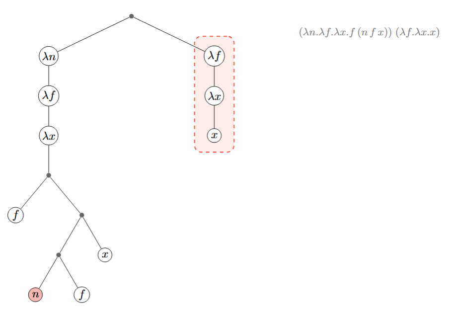
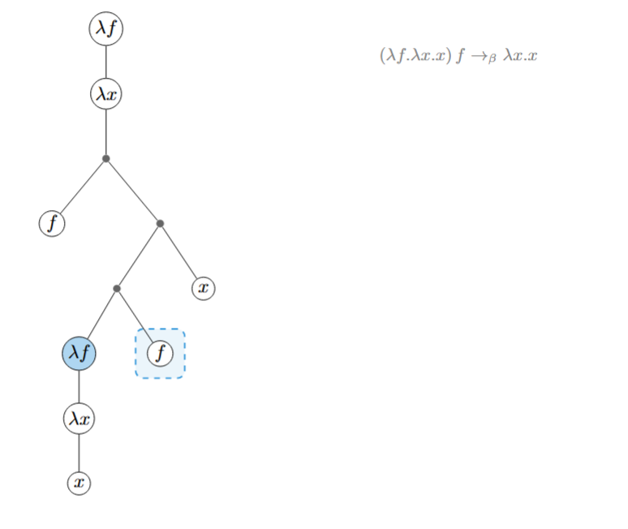
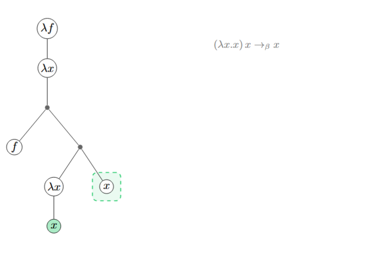
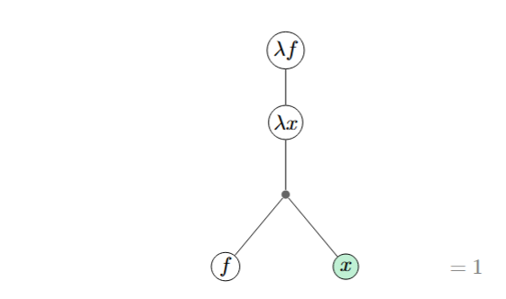
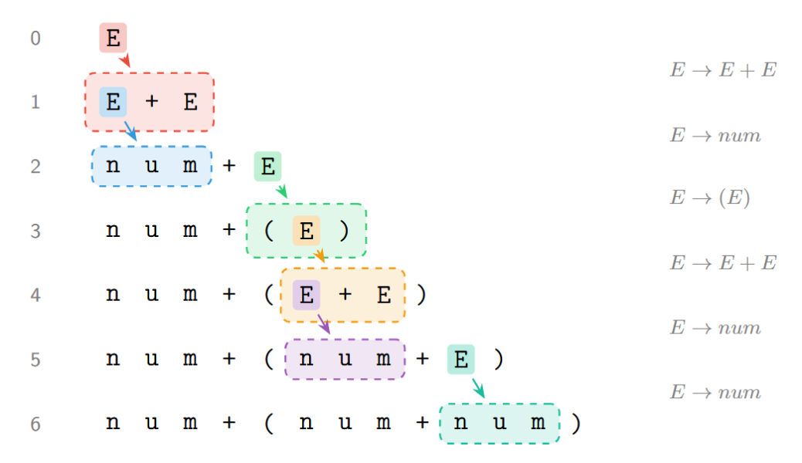

## Lambda 演算

### 无类型 Lambda 演算

#### 从映射到替换

以 $f(x) = x + 1$ 为例，这是最简单的数学函数，输入值 $x$，输出值 $x + 1$，如 $f(2) = 2 + 1 = 3$。在数学上，函数是一个映射关系，任意定义域上的输入都有唯一的输出。

然而可以注意到，$f(x)$ 是通过加法定义的函数，而加法 $+$ 本身也是一个映射，例如：

$$\begin{gathered} + \ 0 \ 0 \to 0 \\ + \ 0 \ 1 \to 1 \\ + \ 1 \ 1 \to 2 \\ \ldots \end{gathered}$$

在定义 $f$ 时，无需为其构建一个新的一一映射，如把 $f$ 定义为

$$f \ 0 \to 1 \\ \ f \ 1 \to 2 \\ \ f \ 2 \to 3 \\ \ldots$$

而是有更优雅的办法：将表达式 $x + 1$ 中的 $x$ 全部替换为输入值，而需要获取 $f \ 1$ 的值，需要先替换，后映射。

由此可引出一个关键观点：函数不仅可以看作直接映射，也可以看作一种项替换过程。Lambda 演算研究的正是以项替换为核心的函数演算。

#### 项与规约

在数学中，一个项可以是值，比如 1437；也可以是函数的应用，比如 $\text{add}(x, 1)$；还可以是函数 $f$，如 $g(f) = f f f$。因此，数学中的项可以认为是函数和值通过函数应用组合而成的。而在上世纪 30 年代，阿隆佐丘奇（Alonzo Church）发明的 Lambda 演算中，不再区分函数和值，只有函数，换句话说对于任何函数，输入是函数，输出也是函数。

Lambda 演算中的函数通过定义 Lambda 头和函数体来实现。例如：

- 示例 1：$\lambda x.\, x x$
- 示例 2：$\lambda f.\, \lambda x.\, f\ f\ x$

需要注意的是，Lambda 演算中没有多元函数，只有单元函数。而多元函数可以通过柯里化实现，即输入一个值，返回一个函数。例如上述示例 2，在一次函数应用后返回另一个函数 $\lambda x.\, f\ f\ x$，继续接受参数才会变成 $f\ f\ x$。这样，示例 2 可以看作接受两个参数的函数。

Lambda 演算中的项可以认为是函数通过函数应用组合而成。例如：

- 示例 3：$(\lambda x.\, x \times x)\ ((\lambda x.\, x + 1)\ 2)$

需要区分 Lambda 演算项和字符串重写系统的项。Lambda 演算项在通常表述中似乎是一系列字符串，如 $\lambda n.\lambda f.\lambda x.f\ (n\ f\ x)$，而其中的括号似乎是字符，但实际上括号只是代表结合的优先级，整体项是一个树结构。下面就展示 Lambda 演算中计算 $\text{succ}\ 0 = 1$ 的过程。









这与字符串重写系统（另一种形式系统，如乔姆斯基文法）的项是不同的。比如在一个简单的文法中，有下面的产生式

$$E \to E + E \mid \text{num} \mid (E)$$

利用这些产生式，我们可以不断向下替换，得到一个简单的算术表达式如 $(\text{num}+\text{num})$



所谓的规约，其实就是 Lambda 演算中执行函数应用的过程。可以写出 $(\lambda x.\, x + 1)\ 2$，这是在描述一个函数应用，最终结果是 $2 + 1$。从 $(\lambda x.\, x + 1)\ 2$ 到 $2 + 1$ 的过程，就是 Lambda 演算的一次规约。

**定义**（项）：Lambda 演算的句法结构称为项（term）。

**定义**（无类型 Lambda 演算的项）：无类型 Lambda 演算的项由变量、Lambda 抽象和函数应用三种形式递归构成：

$$
\begin{aligned}
t ::=\ & x \\
       &\mid \lambda x.t \\
       &\mid t\ t
\end{aligned}
$$

其中，$\lambda x.\, t$ 就是所谓的函数，$\lambda x$ 称为函数头，$x$ 是该函数头约束的变量，$t$ 称为函数体。

**定义**（$\beta$ 规约）：$\beta$ 规约是无类型 Lambda 演算唯一的推演规则：

$$
(\lambda x.t)\ s \to_\beta t[s/x]
$$

无类型 Lambda 演算有一个严重的问题：任何项都可以应用于任何项，包括无意义的应用，如 $(\lambda x.\, x)(\lambda x.\, x\ x)$ 应用于自身会导致不终止。

### 有类型 Lambda 演算

数学中的函数是有定义域和值域的。以 $f(x) = x + 1$ 为例，定义域和值域都是实数，因此写成 $f: \mathbb{R} \to \mathbb{R}$。如果尝试将一个集合 $\text{Set}$ 作用于 $f$，就会出现未定义行为。同样，在 Lambda 演算中，需要为输入和输出指定类型，以防止不符合预期的应用。

**定义**（有类型 Lambda 演算）：有类型 Lambda 演算是给无类型 Lambda 演算添加类型后的演算系统，项的格式变为 $t : A$，每个项都带有类型信息。

各种项的生成规则和消去规则不再是简单的递归生成，而需要通过类型检查。例如，若 $f$ 具有类型 $A \to B$，$a$ 具有类型 $A$，则 $f\, a$ 具有类型 $B$。若此时 $a$ 具有不同于 $A$ 的类型 $X$，则 $f\, a$ 不再是合法的项。这种带类型信息的演算在类型检查期间即可避免许多运行时才会发生的错误，这正是现代编程语言普遍具有完备类型系统的原因。

### 依赖类型 Lambda 演算

在普通的类型 Lambda 演算中，类型和项是天然区分的：无法将类型当作项来使用和计算，也无法在类型中添加项的信息。但如果在类型中添加一些位置来存储项，类型检查能力就会进一步提升。

例如一个列表不仅具有类型 List，而是具有具体的类型 $\text{List}\ \text{Bool}\ 9$，通过类型信息可以知道该列表存储的是 Bool 值，共有 9 个。利用这些信息，可以在编译期避免更多错误。例如，$\text{head}$ 函数期望接受的列表长度至少为 1，则其输入类型可以写成 $\{x:\text{Nat}\} \to \{T:\text{Type}\} \to (\text{List}\ T\ (\text{succ}\ x))$，从而保证任意合法的输入列表长度至少为 1。

在依赖类型 Lambda 演算（Dependent Type Lambda Calculus）中，不再区分类型和项：它们都是表达式，共享同一套语法。句法结构依然是 $a : A$，其中 $A$ 能写在右侧的唯一限制是 $A : \text{Type}$。

为了精确描述依赖类型 Lambda 演算的合法项的句法结构，需要借助更好的表述工具。以下是对依赖类型系统中各个类型的引入、消去和计算规则的相继式演算描述。

**定义**（普通函数类型）：即 Pi 类型（$\to$ 类型）

引入规则：

$$\frac{\Gamma, x:A \vdash t : B}{\Gamma \vdash \lambda(x:A).\, t : A \to B} \to\text{I} \qquad \frac{\Gamma \vdash f : A \to B \quad \Gamma \vdash s : A}{\Gamma \vdash f\ s : B} \to\text{E}$$

计算规则：

$$
(\lambda (x:A).\, t)\ s \to_\beta t[s/x]
$$

例子：$\lambda(x:\text{Nat}).\, \text{succ}\ x$ 的类型为 $\text{Nat} \to \text{Nat}$，应用于 $\text{zero}$ 得到 $\text{succ}\ \text{zero}$。

**定义**（依赖函数类型）：即依赖 Pi 类型（$\Pi$ 类型）

引入规则：

$$\frac{\Gamma, x:A \vdash t : B}{\Gamma \vdash \lambda(x:A).\, t : \Pi(x:A).\, B} \Pi\text{I} \qquad \frac{\Gamma \vdash f : \Pi(x:A).\, B \quad \Gamma \vdash s : A}{\Gamma \vdash f\ s : B[s/x]} \Pi\text{E}$$

计算规则：

$$
(\lambda (x:A).\, t)\ s \to_\beta t[s/x]
$$

与 $\to$ 类型的关键区别在消去规则：返回类型是 $B[s/x]$ 而非 $B$。若 $f : \Pi(n:\text{Nat}).\, \text{Vec}\ n$，则 $f\ \text{zero} : \text{Vec}\ \text{zero}$，$f\ (\text{succ}\ \text{zero}) : \text{Vec}\ (\text{succ}\ \text{zero})$，返回类型随参数值而变化。

**定义**（积类型）：即 Product 类型（$\Sigma$ 类型）

引入规则：

$$\frac{\Gamma \vdash a : A \quad \Gamma \vdash b : B[a/x]}{\Gamma \vdash (a, b) : \Sigma(x:A).\, B} \Sigma\text{I}$$

$$\frac{\Gamma \vdash p : \Sigma(x:A).\, B}{\Gamma \vdash p.1 : A} \text{Proj}_1 \qquad \frac{\Gamma \vdash p : \Sigma(x:A).\, B}{\Gamma \vdash p.2 : B[p.1/x]} \text{Proj}_2$$

计算规则：

$(a, b).1 \to a$，$(a, b).2 \to b$

例如，$\Sigma(n:\text{Nat}).\, \text{Vec}\ n$ 表示"一个自然数 $n$ 以及长度恰好为 $n$ 的向量"。$(3, [a,b,c])$ 是它的一个实例，$p.1$ 得到 $3$，$p.2$ 得到类型 $\text{Vec}\ 3$ 的向量。

**定义**（和类型）：即 Sum 类型

引入规则：

$$\frac{\Gamma \vdash a : A}{\Gamma \vdash \text{inl}\ a : A + B} \text{Inl} \qquad \frac{\Gamma \vdash b : B}{\Gamma \vdash \text{inr}\ b : A + B} \text{Inr}$$

消去规则：

$$\frac{\Gamma \vdash s : A + B \quad \Gamma, x:A \vdash t_1 : C \quad \Gamma, y:B \vdash t_2 : C}{\Gamma \vdash \text{case}\ s\ \text{of}\ \text{inl}\ x \Rightarrow t_1 \mid \text{inr}\ y \Rightarrow t_2 : C} +\text{E}$$

计算规则：

$$\text{case}\ (\text{inl}\ a)\ \text{of}\ \ldots \to t_1[a/x]$$

$$\text{case}\ (\text{inr}\ b)\ \text{of}\ \ldots \to t_2[b/y]$$

例如，Bool 可以定义为和类型 $\text{Unit} + \text{Unit}$，$\text{true} = \text{inl}\ ()$，$\text{false} = \text{inr}\ ()$。消去时两个分支分别处理左右情况，返回相同的类型 $C$。

### 归纳构造演算

**定义**（构造演算）：包含上述所有依赖类型的 Lambda 演算被称为 $\lambda C$，又称构造演算（Calculus of Constructions）。虽然构造演算已经十分强大，甚至可以编码一些归纳类型（以下我们会详细谈到什么是归纳类型）。但构造演算缺少最重要的两个功能：

- 无法表示大消除：大消除指的是返回的值类型不一定都一样，即不同的分支可以返回不同类型的值。比如，在构造演算无法实现这样一个函数，输入一个 Nat，如果是 0 返回 0 其他的返回 False。
- 无法实现归纳原理：构造演算可以实现少部分的结构递归，比如实现加法；但无法实现通用的归纳原理，也就是对于任意的 $P$，如果 $P\ \text{zero}$ 成立，而且 $x \to P\ x \to P\ (\text{succ}\ x)$ 成立，那么 $x \to P\ x$ 成立。这意味着我们连最简单的 $\text{add}\ \text{zero}\ n = n$ 都无法证明。

**定义**（归纳构造演算）：含有递归类型的构造演算叫做归纳构造演算（Calculus of Inductive Constructions）。有两种所谓的递归类型，第一种是在和类型上递归，叫做归纳类型，第二种是在积类型上递归，叫做余归纳类型。

**定义**（归纳类型）：递归和类型，又称归纳类型。

前述和类型只能做有限的分支选择，而归纳类型在此基础上允许递归：构造器的参数可以包含归纳类型自身的实例。

最经典的例子是自然数：

```
inductive Nat {
  zero : Nat
  succ : Nat → Nat
}
```

Nat 有两个构造器：$\text{zero}$ 不带参数，$\text{succ}$ 接受一个 Nat 并返回一个新的 Nat。这样，任何自然数都是 $\text{zero}$ 经过有限次 $\text{succ}$ 嵌套得到的：$\text{zero},\ \text{succ}\ \text{zero},\ \text{succ}\ (\text{succ}\ \text{zero}),\ \ldots$

归纳类型的核心机制是消去子，也称递归子。消去子实现了归纳原理：对一个归纳类型的值做模式匹配，对每个构造器给出对应的处理分支，递归出现的地方自动提供归纳假设。

以 Nat 为例，归纳子 $\text{Nat.rec}$ 的签名为：

```
Nat.rec : (motive : Nat → Type)
        → (zero_branch : motive zero)
        → (succ_branch : Π(n:Nat). motive n → motive (succ n))
        → (q : Nat)
        → motive q
```

$\text{motive}$ 指定"对每个自然数 $n$，要证明/计算什么类型的结果"。$\text{zero\_branch}$ 给出 base case 的值。$\text{succ\_branch}$ 给出归纳步骤：给定 $n$ 和对 $n$ 的归纳假设（$\text{motive}\ n$ 类型的值），构造出对 $\text{succ}\ n$ 的结果。

**计算规则（iota 规约）**：

```
Nat.rec motive z s zero      →  z
Nat.rec motive z s (succ n)  →  s n (Nat.rec motive z s n)
```

$\text{succ}$ 分支的计算不仅代入了 $n$，还递归地对 $n$ 应用了消去子——这就是归纳假设的来源。注意这是一步规约，不是一次性全部展开。计算 $f(3)$ 时，一步规约得到 $s\ 2\ (f\ 2)$，而不是直接算出最终值。

**定义**（余归纳类型）：递归积类型，又称余归纳类型。我们可以用归纳类型定义这样一个类型：

```
Inductive Stream : Type {
  cons : X -> Stream -> Stream
}
```

但显然无法构造出 Stream 的任何一个实例：假设定义了 Stream 实例，那么存在最早定义的 Stream 实例，但这个实例使用 cons 构造，依然需要 Stream 实例，与这个最早构造实例矛盾。但是，如果使用余归纳类型就可以：

```
coInductive Stream : Type {
  cons : X -> Stream -> Stream
}
```

不过，余归纳类型的任何实例依然需要自引用，比如：

```
CoFixpoint zeros : Stream = cons 0 zeros
```

那么 $\text{zeros} = \text{cons}\ (0\ \text{cons}(0\ \text{cons}(0 \ldots)))$

```
CoFixpoint nats : Stream = cons 0 (map (+1) nats)
```

那么 $\text{nats} = \text{cons}\ (0\ \text{cons}(1\ \text{cons}(2 \ldots)))$

本项目不实现余归纳类型。在归纳构造演算中，归纳类型已足以表达所有可证明的数学命题。

#### Lambda 演算的直谓性与结构递归

在命令式语言中可以轻易写出递归函数，如：

$$f(x) = \begin{cases} 1 & \text{if } x = 0 \\ x \cdot f(x-1) & \text{otherwise} \end{cases}$$

这被称为非直谓定义（impredicative definition）。但是在纯粹的 Lambda 演算中，函数是匿名的，无法通过调用自己的名字来实现递归。为了实现递归，函数体必须包括自己的定义，这暗示着如果把函数作为参数传递给自己，那么就可以实现递归了。比如最简单的：

$$f = \lambda x.\, x \cdot (f\ (x-1))$$

可以先定义一个：

$$g = \lambda f.\, \lambda x.\, x \cdot (f\ (x-1))$$

并尝试传递给自己：

$$g\ g = \lambda x.\, x \cdot (g\ (x-1))$$

但是 $g$ 接受两个参数，因此改写 $g$：

$$h = \lambda f.\, \lambda x.\, x \cdot (f\ f\ (x-1))$$

这样：

$$h\ h = \lambda x.\, x \cdot (h\ h\ (x-1))$$

这样 $h\ h$ 函数就实现了 $f$ 的功能。

**定义**（Y 组合子）：

$$Y = \lambda f.\, (\lambda x.\, f\ (x\ x))\ (\lambda x.\, f\ (x\ x))$$

对于任意非直谓定义的函数 $f$，我们都可以改写为类似 $g$ 的形式，然后使用 $(Y\ g)$ 来实现 $h\ h$，也就是 $f$ 的等价直谓形式。

但是在有类型 Lambda 演算中，我们无法实现 Y 组合子，因为 Y 组合子出现了自己引用自己的项 $(x\ x)$。考虑一个最简单的函数 $f$，如果它可以接受自身，那么假设 $f: X \to Y$，那么由于 $f\ f$ 是合法的，所以 $X = X \to Y$，于是 $X = (X \to Y) \to Y, \ldots$，$X$ 有无穷长，这当然是不允许的。

还有一种办法是引入 $\text{fix} : \forall \tau:\text{Type}.\, (\tau \to \tau) \to \tau$ 原语。它和 Y 组合子几乎是一个东西，它的特殊计算规则就是 $\text{fix}\ F = F\ (\text{fix}\ F)$。从类型看，对于任何非直谓函数 $f: X \to Y$，我们依然改写为 $g: (X \to Y) \to (X \to Y)$，那么 $\text{fix}\ g: X \to Y$，从类型上看确实是对的。

引入 fix 的问题是，可以通过 $\text{fix}\ X \to X$ 得到任意类型 $X$。因为对于任意类型 $X$，$X \to X$ 函数一定存在（返回参数就行了）。但是在定理证明器中 empty 类型是不可被创造的，而 fix 打破了这个约定，所以有 fix 原语的系统没有逻辑一致性。

为了维护逻辑一致性，还要支持递归，那么系统就只能引入所谓的良基递归。结构递归就是一种良基递归，现在定理证明器都是通过归纳类型的消去子来实现结构递归这样的良基递归，可以保证终止，而且不会破坏一致性。

### 各种 Lambda 演算的规约

本项目的基础是依赖类型 Lambda 演算，因此规约模型也是依赖类型 Lambda 演算的规约模型。我们先回顾 Lambda 演算是如何规约的：

- **无类型 Lambda 演算的规约**：本质上就是一系列函数应用的项的规约。如，$(\lambda x.\, x\ x)\ (\lambda x.\, x\ x)$ 经过一步 Beta 规约得到自身，永不终止。又如，$(\lambda f.\, \lambda x.\, f\ (f\ x))\ (\lambda y.\, \text{succ}\ y)\ \text{zero}$ 经过 Beta 规约和化简得到 $\text{succ}\ (\text{succ}\ \text{zero})$。

- **有类型 Lambda 演算的规约**：在无类型 Lambda 演算的情况下附带类型检查。如，$(\lambda (x:\text{Nat}).\, \text{succ}\ x)\ 2$ 是合法的，类型检查通过后 Beta 规约得到 $\text{succ}\ 2$。而 $(\lambda (x:\text{Nat}).\, \text{succ}\ x)\ \text{true}$ 在类型检查阶段就会被拒绝，因为 $\text{true}$ 的类型是 $\text{Bool}$，不是 $\text{Nat}$。

- **依赖类型 Lambda 演算的规约**：在有类型 Lambda 演算的基础上需要把项的值提升到类型检查。由于依赖类型的存在，$\lambda (x:T_1) \Rightarrow \lambda (y:T_2) \Rightarrow \lambda (z:T_3) \Rightarrow \text{expr}$ 做 Beta 规约时，不仅会把 expr 中的 $x$ 替换为 $x_v$，还会把 $T_2$、$T_3$ 中出现的 $x$ 换成 $x_v$。如果一个项是 Lambda 开头而且第二个项存在，那么只要通过了类型检查就可以 Beta 规约。

这是和普通类型系统的编程语言最大的不同。普通类型系统中，只要把叶子节点的类型全部 infer 一下，之后进行 infer 都不需要任何叶子节点的值的内容，换句话说，我们完全可以只考虑类型上的演算，比如 $(\text{Nat} \to \text{Bool})\ \text{Nat}$ infer 得到 $\text{Bool}$。而依赖类型系统（包括多态），我们都会把项的值提升到类型的演算上。

- **归纳类型的规约**：这个项目在依赖类型 Lambda 演算的基础上添加了归纳类型，但是与严格的 CIC 不同，这个项目不实现类型宇宙和严格正性检查，因此可以看成 CIC 的一个简化版子集。考虑下面的例子：

```
inductive Nat {
    zero : Nat,
    succ : Nat -> Nat
}
```

其中 Nat 被称为类型构造器，zero 被称为无参数据构造器，succ 被称为有参数据构造器。定义了一个归纳类型后，系统会自动生成消去子。

### 归纳构造演算的规约动作

规约是将表达式逐步化简的过程。本章首先介绍所有规约动作。

**定义**（Beta 规约）：$(\lambda x.\, t)\ a \to t[a/x]$

$t[a/x]$ 表示把项 $t$ 内所有的 $x$ 换成 $a$，即纯粹的 Lambda 演算唯一的规约动作。

实际上，上述 $t[a/x]$ 是简化模型，没有考虑 shadow，实际代换模型需要考虑 $t$ 中给非自由出现的 $x$ 重命名。完整的规约模型中，不再使用 $[a/x]$ 记号，而是使用 $[a \to x]$ 记号，通过以下规则定义：

$$[a \to x]x = a \quad \text{（命中变量）}$$

$$[a \to x]y = y, \text{若 } y \neq x \quad \text{（跳过无关变量）}$$

$$[a \to x](\lambda x.\, t) = \lambda x.\, t \quad \text{（遮蔽：同名 binder 停止替换）}$$

$$[a \to x](\lambda y.\, t) = \lambda y.\, [a \to x]t, \text{若 } y \neq x \text{ 且 } y \notin \text{FV}(a) \quad \text{（安全：无需重命名）}$$

$$[a \to x](\lambda y.\, t) = \lambda y_1.\, [a \to x]t_1, \text{若 } y \neq x \text{ 且 } y \in \text{FV}(a) \quad \text{（不安全：先将 } y \text{ 重命名为 } y_1 \text{，再替换）}$$

$$[a \to x](t_1\ t_2) = [a \to x]t_1\ [a \to x]t_2 \quad \text{（递归替换）}$$

之后我们不再使用 $[a \to x]$ 而是使用 $[a/x]$，一个原因是便于简化描述，另一个原因是我们会在规约之前使用 de Bruijn index 转换，从而可以直接使用 $[a/x]$ 语义。

如，Church 数的乘法 $\text{mul} = \lambda m.\, \lambda n.\, \lambda f.\, m\ (n\ f)$，应用 $\text{mul}\ 2\ 3$ 经过 Beta 规约得到 $6$。又如，Y 组合子 $Y = \lambda f.\, (\lambda x.\, f\ (x\ x))\ (\lambda x.\, f\ (x\ x))$ 满足 $Y\ g = g\ (Y\ g)$，展示了 Beta 规约的自指能力。

**定义**（Zeta 规约）：$\text{let}\ x := v\ \text{in}\ t \to t[v/x]$

let 的求值在 elab 阶段就变成 Lambda 应用：$\text{let}\ x := v\ \text{in}\ t \to (\lambda (x:v) \Rightarrow t)\ v$。因此 Zeta 规约自动变成 Beta 规约。

**定义**（Delta 规约）：解析 $\text{def}\ x: T = v$ 后会把 $x$ 加入上下文，因此

$$x \to v \quad \text{若} \quad \Gamma \Rightarrow x:T = v$$

如果在某个项 $t$ 中某个值是变量，而且 $x$ 作为变量在上下文有值 $v$，那么 Delta 规约就是 $t[x/v]$。不过，我们一般不会对整个项做一次 Delta 规约，而是只有需要的时候才会展开——也就是先尝试语法相等，不相等再 Delta 展开。

在纯粹的 Lambda 演算中，没有所谓的上下文，因此没有 Delta 规约。目前的大部分函数式编程也并非完全基于 Lambda 演算，而是支持全局变量声明。

例如，给定上下文 $\text{add} : \text{Nat} \to \text{Nat} \to \text{Nat},\ \text{add} = \lambda m.\, \lambda n.\, \text{Nat.rec}\ (\_.\, \text{Nat})\ n\ (\lambda k.\, \lambda \text{acc}.\, \text{succ}\ \text{acc})\ m$，对 $\text{add}\ 3\ 5$ 进行 Delta 规约会把 $\text{add}$ 展开为其定义体，然后再进行 Beta 和 Iota 规约。

**定义**（Iota 规约）：针对归纳类型的消去子作用于构造子时所触发的计算规则。以自然数为例，其递归子 $\text{Nat.rec}$ 满足：

- $\text{Nat.rec}\ P\ b\ s\ \text{zero} \to b$
- $\text{Nat.rec}\ P\ b\ s\ (\text{succ}\ n) \to s\ n\ (\text{Nat.rec}\ P\ b\ s\ n)$

例如，加法函数 $\text{add}$ 基于 $\text{Nat.rec}$ 定义，其 Iota 规约可直接写作：

- $\text{add}\ \text{zero}\ n \to n$
- $\text{add}\ (\text{succ}\ m)\ n \to \text{succ}\ (\text{add}\ m\ n)$

Iota 规约是归纳构造演算中使递归定义与归纳证明得以实现的核心机制。

**定义**（Eta 规约）：$\lambda x.\, f\ x \to f$（$x$ 不在 $f$ 中自由出现），是最简单的外延相等。

如，$\lambda x.\, \text{add}\ 1\ x$ 经过 Eta 规约得到 $\text{add}\ 1$。
