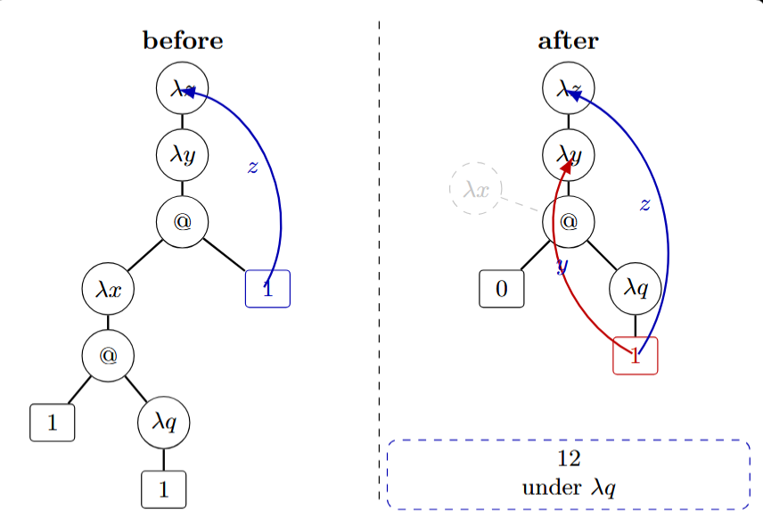
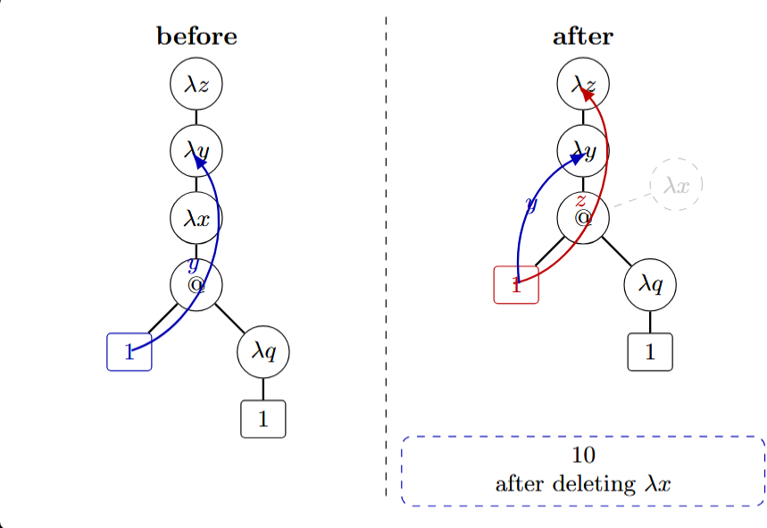

## 规约器的设计

### 构造器与变量的统一视角

#### 构造器是无值变量

我们最终的系统是在依赖类型 Lambda 演算上添加了归纳类型，因此我们的规约中的 IDENT 除了可以是函数、变量外，还有构造器。

然而，一个有趣的事实是，数据构造器和类型构造器其实也可以看成是某种没有值的变量。

一方面，这些构造器确实具有类型，比如 `Nat : Type`，`succ : Nat -> Nat`。这暗示 `succ` 的行为与一个类型同样为 `Nat -> Nat` 的普通函数是一致的——两者都是输入一个 Nat 值，输出一个 Nat 值，只不过普通函数会进行 Beta 规约，而 `succ` 不会进行任何规约，只会积累后面的参数。

在全局上下文中，任何普通变量和函数都必须有值，而在局部上下文中，一个变量可以通过 Lambda 头约束，因此这个变量可以添加到局部上下文，但是没有值。如果一个类型为 `Nat -> Nat` 的普通函数 `f` 没有值，那么 `f` 应用于 `zero` 后，无法进行 Beta 规约，因此其规约在 `f zero` 后就停下来了，这恰好与 `succ` 应用于 `zero` 后停在 `succ zero` 的行为是完全一致的。

另一方面，无值的两个变量相等当且仅当 de Bruijn index 完全相同，或者全局名称完全相同。这与构造器的行为一致：两个构造器相等当且仅当他们的名字相等。

因此，我们不必把构造器当成函数、变量之外的第三个范畴，而是当成没有值的变量即可。

#### 变量与值

若构造器也是变量，例如：

```
zero : Nat
```

就可以认为是声明了一个"变量"叫 `zero`，属于 `Nat` 类型。但是这个"变量"只是声明了类型，而没有所谓的值，但到底什么是值呢？

为了研究到底什么是值，我们来定义一个有值的变量 `x : Nat, x = succ zero`。

`x` 与其说是一个变量，不如说是某个表达式的别名。`x` 之所以具有 `Nat` 类型，是因为其值 `succ zero` 具有类型 `Nat`。可以观察到，变量其实起到了给表达式起别名的作用。

定义变量的语法和定义构造器的语法是完全一致的，只不过变量可以赋值，而确定一个变量的类型是通过计算其值的类型。既然两者语法是一致的，都是 `IDENT:Type`，这暗示着任何形似 `IDENT:Type` 的声明都是在表明 IDENT 是某种变量，是某种别名。

那么，对于没有值的变量，比如 `zero`，到底是什么表达式的别名呢？是什么让我们确信 `zero : Nat`，即使我们不知道 `zero` 的值？

答案是，没有理由，这是我们需要无条件相信的东西。否则继续追问下去，就像追问一个词的定义一样，如果不在某个词上停止，就会无穷倒退。现实中，我们对句子的追问会停止在原始概念，而这些原始概念的意义，是通过不断与其他概念的碰撞而产生的。这恰好印证了日常语言学派的观点，语言的意义在于使用。

归纳类型定义提供了实现原始概念的唯一方法，也就是说，IDENT 不会继续求值的情况只会因为这个 IDENT 是构造器。

一个可能的反驳是，Lambda 头定义的绑定变量也是不会继续求值的，但 Lambda 头定义的绑定变量是可以通过 Beta 规约实现其可赋值的功能，而构造器在任何情况下都不可能被赋值。

因此，无论是 Lambda 头定义的绑定变量，还是 var 和 fun 定义的全局变量，本质上都是表达式的别名，都可以通过 Beta/Delta 规约而实现求值。

#### 统一规约视角

上述的讨论提供了一个统一的视角：无论 IDENT 是函数、变量还是构造器，不再继续尝试规约当且仅当 IDENT 没有 value，判断两个无法求值的 IDENT 定义相等仅当两者的 de Bruijn index 完全相同，或者全局名称完全相同。

因此，在对 IDENT 规约时，我们无需做各种特殊的判定，比如判定这个到底是不是构造器，是不是消去子。我们可以有一个统一的规则：无论 IDENT 是什么，可以继续给 IDENT 规约当且仅当 IDENT 有值。

除了给 IDENT 规约，我们还需要给表达式规约，其中最重要的是给 CApp 规约。由于消去子也可以认为是无值的函数，因此 CApp 的规约不仅包括 Beta 规约还包括 Iota 规约。

因此我们不能简单地认为 CApp 的头部如果是无值变量便不再进行任何规约，而是需要判断头部是否是消去子，参数是否足够，最后的参数是否有构造器头，当这三个条件满足便可触发一次 Iota 规约。

当前项目实现中，Beta 规约是直接对项做代换（de Bruijn index + shift）实现的，不使用闭包策略，也不使用先变换为语义值再 quote 回项这条 NbE 路径。

### 核心语法下的规约

经过繁饰的 de Bruijn 转换，所有局部变量都变成了索引，不再有变量名冲突。而对于用 de Bruijn 索引表示的项，其各种规约需要重写设计了。

#### Beta 规约

Beta 规约最主要的就是处理为了保持语义，而需要 de Bruijn 索引偏移的问题。以 $\lambda z.\lambda y.\, (\lambda x.\, y\ (\lambda q.\, x))\ z$：$\lambda.\lambda.(\lambda.1\ (\lambda.1))\ 1$ 中内部 $(\lambda x.\, y\ (\lambda q.\, x))\ z: (\lambda.1\ (\lambda.1))\ 1$ 的规约为例子。理论上最后的结果为 $y\ (\lambda q.\, z): 0\ (\lambda.2)$。

如果光看 $(\lambda.1\ (\lambda.1))\ 1$ 我们会递归寻找 $(\lambda.1\ (\lambda.1))$ 中最外层 $\lambda$ 绑定变量的位置：初始 this 值为 $-1$，每穿过一个 $\lambda$，值 this 加 1。$(\lambda.1\ (\lambda.1))$ 的最外层 $\lambda x$ 也算一个 $\lambda$。那么值 this 就是这一层 x 对应的 de Bruijn 索引值。如果当前处理变量 c 的 de Bruijn index = this，那么 c 就是 $(\lambda.2\ (\lambda.1))$ 中 $\lambda$ 绑定的变量。这里就是 $(\lambda.1\ (\lambda.1))$ 中的最里面的 1，把他直接换为最外层的 1，得到 $(\lambda.1\ (\lambda.1))$ 去掉 $\lambda x$ 头，得到 $1\ (\lambda.1)$。我们得到 $1\ (\lambda.1)$，理论上的结果应该是 $0\ (\lambda.2)$。这意味着我们犯了非常多的错误！

首先，我们错误的代换是 z:1，但是这里却变成了 z:2，为什么？观察原表达式可以发现，因为 z 穿过了 $\lambda q$ 头，所以 z 的深度需要变化。因此，每次替换 x 的时候，都需要根据 x 当前的 de Bruijn 索引值 s（或者当前的 this 值），把替换后的这个位置的 z 的 de Bruijn 索引添加 s（或者 this 值）。



其次，我们错误的代换是 y:1，但是这里却变成了 y:0，为什么？观看原来的表达式可以发现，y 作为 $\lambda x$ 外层的变量，被提出来了，所以 y 的深度需要减小。因此，每次替换 x 的时候，我们不仅要看 x，还要看其他深度大于 x 的变量（即当前变量索引值大于 this），并给它们的 de Bruijn 索引都减去 1。



那么，$\lambda x$ 的函数体内，当前变量深度如果小于同层的 x 怎么办？答案是，无需变化，因为这些变量不会绑定到 $\lambda x$ 甚至外面的 $\lambda$ 头，所以这些变量的 $\lambda$ 头到这些变量的深度完全没有任何变化。

#### Delta 规约

Delta 规约是最简单的，直接从全局上下文看是不是有值变量，是的话就直接展开。

#### Iota 规约

Iota 规约分为两步，一步是把值赋予给对应位置的模式变量，另一步是处理归纳假设。Iota 规约是一步规约，而不是一下子就给全部递归处求值，就像计算函数：

$$f(n) = n \cdot f(n-1)$$
$$f(0) = 1$$

那么计算 $f(3)$，一步规约后是 $3 \cdot f(2)$，而不是 $3 \cdot 2 \cdot 1 \cdot f(0)$。接下来我们默认还是用表面语法，而把这些逻辑迁移到核心语法是非常简单的。以自然数为例：

```
inductive Nat {
    zero : Nat,
    succ : Nat -> Nat
};
```

Nat.rec 的签名为：

```
Nat.rec : (motive : Nat -> Type)
       -> (zero_branch : motive zero)
       -> (succ_branch : (n:Nat) -> motive n -> motive (succ n))
       -> (q : Nat)
       -> motive q
```

记 `P = Nat.rec motive zero_branch succ_branch`，则 `P : (q:Nat) -> motive q`。完整实例化即 `P target`，Iota 一步规约：

```
P zero       = zero_branch
P (succ x)   = succ_branch x (P x)
```

一般地，若 target 为构造器应用 `C args`，则 `P (C args) = C_branch args`——把构造器替换为对应分支。对于有参数和索引的归纳类型，例如：

```
D.rec branch1 branch2 branch3 params indices target
```

记 `P = D.rec branch1 branch2 branch3`，则 `P params indices (C args) = C_branch args`。构造器的完整签名已包含 params，因此 args 中自然有 params 值，不需要额外区分。

如果 branch 需要归纳假设，那么除了把构造器参数传给 branch 外，还要构造递归调用。以 `List` 为例：

```
inductive List (A:Type) : Nat -> Type {
  nil : List A zero,
  cons : (k:Nat) -> A -> List A k -> List A (succ k)
};
```

在核心语法中，没有 param 和 index 的区别。记 `P = List.rec motive nil_branch cons_branch`，Iota 规约一步：

```
P A (succ k) (cons A k x xs)
= cons_branch A k x xs (P A k xs)
```

直接递归的调用形如 `P ... rec_ocur`，中间的 `...` 是为了实例化 `rec_ocur` 的类型而需要的。`rec_ocur` 出现在构造器的 Pi 链中，走到 `rec_ocur` 这个位置时，前面的参数已经全部输入，`rec_ocur` 的类型就完全确定了——因为构造器的类型是依赖的。因此只要把 `rec_ocur` 的类型（de Bruijn CTerm）前面包 Lambda，应用它之前的全部参数，Beta 规约，就可以得到实例化类型，提取 D 的参数即是 `...`。

以 List 为例，递归调用的 `A` 和 `k` 是实例化 `xs` 的类型所需：`xs` 的类型 `List A k` 依赖于它前面的参数 `[A, k, x]`，包成 Lambda 并应用前三个实际参数：

```
(\(A:Type) => \(k:Nat) => \(x:A) => List A k) A_val k_val x_val
```

Beta 规约后得到 `List A_val k_val`。List 的参数 `[A_val, k_val]` 就是递归调用的 `...`。

对于高阶递归字段，例如：

```
inductive Tree (A:Type) : Type {
  leaf : A -> Tree A,
  node : (k:Nat) -> (Fin k -> Tree A) -> Tree A
};
```

`node` 构造器的 Pi 链：`(A:Type) → (k:Nat) → (f:Fin k → Tree A) → Tree A`。记 `P = Tree.rec motive leaf_branch node_branch`，那么：

```
P A (node A k f) = node_branch A k f (\i => P A (f i))
```

IH 为 `\i:Fin k => P A (f i)`，不再是一个值，而是 Lambda 表达式，接收高阶参数 `i` 后递归调用 `P`。其中索引 `A` 的获取方式与直接递归相同：把 `f` 的类型 `Fin k → Tree A` 包成两层 Lambda，应用 `A_val k_val`，得 `Fin k_val → Tree A_val`。去掉 Pi 头后，`Tree A_val` 就是 D 的应用，参数 `[A_val]` 即是 `P` 需要的 `...`。

这里有一步关键观察——去掉 Pi 头后，树里面的值可能依赖于高阶 Pi 头的参数（比如索引引用了某个高阶参数），此时提取出来的 `...` 不是封闭项。但放回 `\i ... \0 => P ... (f ... i ... 0)` 的 Lambda 包裹中，这些变量被 IH 自己的高阶参数重新绑定，自然又是闭合的。

投影函数 `D.fi`（来自 `product`）是有值变量，其值是 `D.elim` 的特化应用（motive 固定为 `\_. Fi`，branch 固定为取第 i 个字段）。因此 `D.fi (D.mk v1 ... vn)` 的求值路径是先 Delta 展开 `D.fi`，再通过 Iota 规约取出 `vi`。投影不是独立的规约形式，而是 Delta + Iota 的组合。
