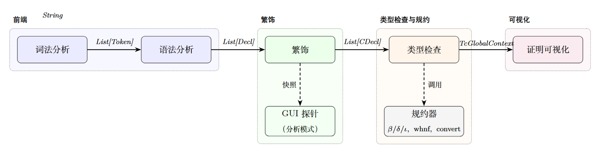

## 整体架构概览

本系统采用分阶段流水线结构，各组件的输入输出与内部上下文如下图所示。

词法分析将源码切分为 token 序列，语法分析根据表面文法构造声明列表。繁饰分为两个阶段：先将表面语法消去语法糖、生成消去子与投影，得到受限表面语法；再将受限语法转换为 de Bruijn 索引表示的核心语法。类型检查器逐条处理核心声明，执行双向类型检查与转换检查，转换检查中调用规约器完成 $\beta$/$\delta$/$\iota$ 规约。GUI 分析模式下，繁饰探针在抵达目标表达式时返回上下文快照，不触发完整流水线。

