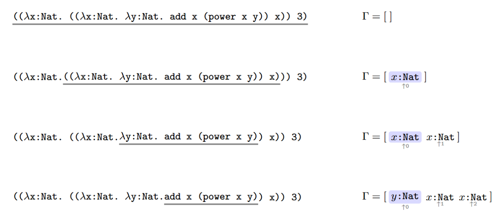
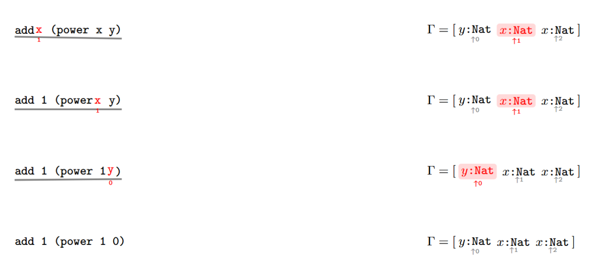

# 繁饰

繁饰（elaboration）是将表面语法树翻译为核心语法树的过程。整体上，繁饰分为两个连续的阶段：

1. 将表面语法翻译为受限表面语法；
2. 将受限表面语法统一转换为 de Bruijn 表示的核心语法。

第一阶段负责消去各种表面语法糖，并生成后续 `match` / `case` 解糖所需的辅助信息；第二阶段负责消去局部变量名字，将所有局部引用统一编码为位置索引。

注意，虽然核心语法的判等不依赖 binder 名字，但是为了报错和调试方便，`Pi` 与 `Lambda` 头在实现中依然保留名字信息。


### 约束检查

在翻译之前，繁饰器需要先检查表面语法是否满足第三章规定的各种约束。这里的约束主要包括：

1. 全局名字不能重复定义；
2. `inductive`、`sum`、`product` 的家族形式必须合法；
3. 数据构造器返回类型必须回到所属的类型构造器；
4. 递归出现必须满足参数统一；
5. `match` 与 `case` 的族实例、`bind` 名字列表和分支顺序必须合法；
6. `DOT` 形式必须对应系统允许的点号引用；
7. `_` 只能出现在绑定位置，不能出现在普通表达式位置。

除了一些必要的检查外，大部分都是为了满足归纳类型、和类型与积类型的语义约束，这样在给 `match` 和 `case` 解糖的时候就无需考虑解析失败的问题了。

### 数据结构

繁饰阶段需要维护三类数据：全局上下文、局部上下文以及辅助数据结构。

**全局上下文**

繁饰阶段的全局上下文需要记录以下信息：

1. 每个已经定义的全局名字；
2. 该名字对应的类别标签 `tag`。

这里的 `tag` 只回答“这个名字属于哪一类全局对象”。对本系统而言，至少需要区分：普通全局定义、类型构造器、数据构造器、归纳子或消去子、投影函数。

全局上下文的作用主要有两个：

1. 拒绝重复定义；
2. 在遇到一个原子名字时，先判断它是否已经是一个可用的全局名字，再根据 `tag` 决定是否需要进一步查询辅助数据结构。

**局部上下文**

繁饰阶段的局部上下文记录当前表达式中所有可见的局部绑定名。这里的局部绑定包括：

1. `Pi` 头引入的参数名；
2. `Lambda` 头引入的参数名；
3. `let` 引入的局部名；
4. `match` / `case` motive 中引入的 `bind` 名；
5. 各分支中引入的字段名与归纳假设名。

由于这一阶段尚未进入 de Bruijn 表示，因此局部上下文首先表现为一个名字栈。对一个原子表达式，繁饰器需要先查询局部上下文，再查询全局上下文，以决定该名字应被解释为局部引用还是全局引用。

**辅助数据结构**

为了正确地把 `match` / `case` 翻译为归纳子或消去子应用，系统还需要维护一组只服务于归纳类型、和类型与积类型的辅助数据结构。对每个类型构造器，需要记录：

1. 参数列表与参数类型列表；
2. 索引列表与索引类型列表；
3. 该类型构造器下各个数据构造器的声明顺序。

对每个数据构造器，需要记录：

1. 字段列表；
2. 目标索引表达式列表；
3. 递归字段列表。

其中，所谓“目标索引表达式”，指的是数据构造器返回值中的各个索引值如何由参数与字段计算得出；所谓“递归字段的索引表达式”，指的是某个递归字段作为同一家族实例时，其索引值如何由前面的 binder 计算得出。

对于每个递归字段，还需要记录：

1. 字段在构造器字段列表中的位置；
2. 该递归字段属于直接递归还是高阶递归；
3. 若为高阶递归，则其前面的高阶 `Pi` 头参数列表。
4. 该递归字段的索引表达式列表。

这些信息是构造归纳假设类型所必需的。没有这些信息，系统就无法在分支中生成与 motive 对应的 `ih` 参数。

### 匿名变量与自动命名

繁饰过程中，有些 binder 没有用户给定的名字。此时，系统必须为这些位置自动生成内部名字。自动命名的主要来源如下：

1. 索引中的匿名参数；
2. 数据构造器中的匿名字段；
3. 高阶递归字段内部的匿名 `Pi` 头参数；
4. `match` / `case` 中省略的 `as` 名；
5. `match` / `case` 中省略的 `bind` 名；
6. 分支中用 `_` 代替的字段名；
7. 省略或匿名给出的归纳假设名。

自动生成的名字只作为繁饰阶段和 de Bruijn 索引转换阶段的桥梁。它们的任务是为后续的名字替换和作用域处理提供一个明确的中间表示，而不是向对象语言引入新的语义实体。

### 索引表达式与名字替换

归纳类型的数据构造器不仅携带字段列表，还隐含了“该数据构造器返回的是哪一个家族实例”这一信息。这个信息在实现上表现为索引表达式。

设一个归纳类型为

$$
D\ (p_1:P_1)\ \cdots\ (p_k:P_k)\ :\ I_1 \to \cdots \to I_m \to Type
$$

则对每个数据构造器，需要记录两类索引表达式：

1. **目标索引表达式**：数据构造器返回值类型中的 $m$ 个索引值；
2. **递归字段索引表达式**：每个递归字段类型实例中的 $m$ 个索引值。

这些表达式最初写在数据构造器作用域中，因此其中引用的是数据构造器自己的参数名与字段名。而在 `match` / `case` 分支中，系统引入的是分支作用域下的新名字。于是，繁饰器必须建立一张名字替换表，把数据构造器作用域中的原始名字替换为分支作用域中的实际名字。

设替换表为

$$
\sigma = \{p_i \mapsto b_i,\ f_j \mapsto g_j\}
$$

则：

1. 目标索引表达式要使用完整的替换表；
2. 某个递归字段的索引表达式只使用该字段之前已经出现的 binder 的映射。

这样才能正确区分“某个索引值依赖于哪个字段”和“某个字段还没有进入作用域”这两件事情。

### 归纳假设的生成规则

在 `match` 分支中，并不是每个字段都对应一个归纳假设，只有递归字段才会生成归纳假设。

**定义**（直接递归字段的归纳假设）  
若某个字段的类型直接以

$$
D\ p_1\ \cdots\ p_k\ i_1\ \cdots\ i_m
$$

为头，则称该字段为直接递归字段。设该字段名为 $x$，则对应的归纳假设类型为：

$$
motive\ p_1\ \cdots\ p_k\ i_1\ \cdots\ i_m\ x
$$

**定义**（高阶递归字段的归纳假设）  
若某个字段的类型形如

$$
(u_1:U_1) \to \cdots \to (u_r:U_r) \to D\ p_1\ \cdots\ p_k\ i_1\ \cdots\ i_m
$$

则称该字段为高阶递归字段。设该字段名为 $f$，则对应的归纳假设类型为：

$$
(u_1:U_1) \to \cdots \to (u_r:U_r) \to motive\ p_1\ \cdots\ p_k\ i_1\ \cdots\ i_m\ (f\ u_1\ \cdots\ u_r)
$$

因此，繁饰器在构造分支类型时，除了要实例化普通字段类型，还必须按递归字段的种类额外生成对应的 `ih` 参数类型。

### 声明翻译

繁饰器首先把各种表面声明翻译为受限表面语法声明，然后再统一转换为核心声明。

#### inductive

对于

```
inductive D (p1:P1) ... (pk:Pk) : I1 -> ... -> Im -> Type {
  c1 : T1
  ...
  cn : Tn
}
```

系统生成：

1. 类型构造器声明 `D`；
2. 数据构造器声明 `c1, ..., cn`；
3. 归纳子声明 `D.rec`；
4. 对应的辅助数据结构条目。

其中，类型构造器 `D` 的类型是参数与索引的 `Pi` 链，数据构造器则在参数前缀补齐后，再以 `D` 的某个家族实例为返回值。

#### sum

`sum` 可视为不允许递归字段、且没有参数部分的特殊类型族。系统对 `sum` 的翻译方式与 `inductive` 相同，但自动生成的是消去子 `D.elim`，而不是归纳子 `D.rec`。

#### product

`product` 可视为只有一个构造器的特殊类型族。对

```
product D { f1:F1, ..., fn:Fn }
```

系统生成：

1. 唯一数据构造器 `D.mk`；
2. 消去子 `D.elim`；
3. 各字段对应的投影函数 `D.f1, ..., D.fn`。

其中，依赖字段的返回类型需要通过前面字段的投影结果进行实例化。

#### var / claim / fun / theorem

这四类声明都翻译为“有类型且可能有值”的定义。区别只在于 `kind` 标签不同。

1. `var` 与 `claim` 直接保留其给定的类型和值；
2. `fun` 与 `theorem` 则把参数列表分别折叠为类型上的 `Pi` 链和值上的 `Lambda` 链。

#### axiom / example / 等式定义

1. `axiom` 翻译为无值全局定义；
2. `example` 翻译为匿名全局定义，并自动分配不冲突的名字；
3. 等式定义则翻译为显式的 `Lambda` 链定义。

### 表达式翻译

表达式翻译的目标是把表面语法统一化为仅含 `Atom`、`App`、`Pi`、`Lambda`、`Type` 五种基本形式的受限表面语法。

#### 基本表达式

1. 标识符先查询局部上下文，再查询全局上下文；
2. `Type` 与 `Prop` 在这一阶段统一记为 `Type`；
3. 括号表达式直接去括号；
4. 普通箭头类型翻译为匿名 binder 的 `Pi`；
5. 依赖箭头类型翻译为具名 `Pi`；
6. 函数应用翻译为左结合嵌套应用；
7. `Lambda` 翻译为具名 `Lambda`。

#### let

`let x:T = v in body` 翻译为

$$
(\lambda (x:T) \Rightarrow body)\ v
$$

#### match

`match` 是归纳子 `D.rec` 的表面语法糖。其翻译结果为：

$$
D.rec\ motive\ branch_1\ \cdots\ branch_n\ family\_args\ scrutinee
$$

其中：

1. `motive` 由 `bind` 名、`as` 名和 `return` 后的表达式共同构造；
2. 每个 `branch` 都被翻译为一个显式的 `Lambda` 项；
3. 分支中字段类型、目标索引表达式和归纳假设类型都通过前述名字替换规则实例化。

#### case

`case` 是消去子 `D.elim` 的表面语法糖，其翻译方式与 `match` 相同，只是分支中不生成归纳假设。

#### 其余语法糖

1. `IDENT<a,b,c>` 翻译为积类型构造器应用；
2. `[T] a == b` 翻译为 `Eq T a b`；
3. `DOT` 先检查合法性，再按固定规则解析为对应的全局引用。

### de Bruijn 索引转换

经过前面的翻译后，系统得到的是带名字的受限表面语法树。最后一步是把这些局部名字统一转换为 de Bruijn 索引，从而得到核心语法。

为此，系统维护一个局部上下文栈 $\Gamma$：

1. 每进入一个 `Pi` 或 `Lambda` binder，就向栈顶压入一个新名字；
2. 最近的 binder 对应索引 0；
3. 更外层的 binder 按距离递增编号。

于是，受限表面语法中的名字引用被解释为：

1. 若名字出现在局部栈中，则翻译为对应的 `CVar(k)`；
2. 若名字不在局部栈中，则翻译为 `CGlobal(name)`；
3. `Pi`、`Lambda`、应用和 `Type` 分别翻译为对应的核心语法构造。

以在空的局部上下文下，对(\(x:Nat)=>(\(x:Nat)=>\(y:Nat)=>add x (power x y)) x) 3 中add x (power x y)进行de Bruijn 索引转换为例子。



我们最终得到局部上下文  $\Gamma  = [y : \text{Nat},\; x : \text{Nat},\; x : \text{Nat}]$，之后就是对add x (power x y)进行转换。



注意到上下文中有两个x，而转换的时候永远选择de Bruijn 索引最小的那一个。
