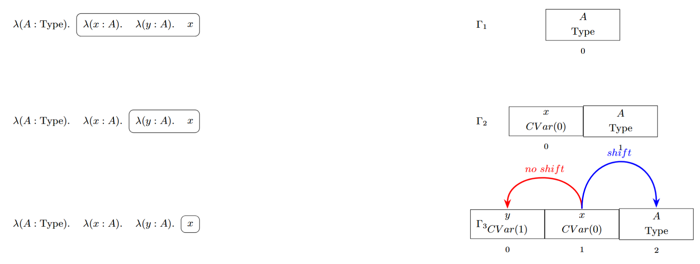

## 类型检查

类型检查以繁饰输出的核心声明列表 `List[CDecl]` 为输入，按核心声明出现的顺序逐条处理。每条声明检查通过后，立即注册到类型检查阶段的全局上下文中，供后续声明、转换检查与规约使用。

本系统采用双向类型检查。`infer` 负责从项的结构出发推导其类型，`check` 负责在给定目标类型下验证一个项。由于核心语法已经使用 de Bruijn index 表示局部变量，因此类型检查阶段的重点在于维护局部上下文以及转换检查。

### 推导与检查

类型检查阶段需要维护局部上下文、全局上下文以及一组服务于 Iota 规约的辅助信息。

**局部上下文**

局部上下文 $\Gamma$ 是一个类型栈。若某个局部变量在核心语法中记为 `CVar(k)`，则 $\Gamma[k]$ 给出它的类型。实现中另存一份名字栈，仅用于错误信息输出。

然而，如果我们直接从局部上下文中获取类型，会因为上下文的不同导致语义错位。
以λ(A:Type).λ(x:A).λ(y:A).x的上下文解析为例子，看看如果直接获取类型值会怎么样：

随着局部上下文逐步扩展，x的类型值Var(0)会直接指向当前栈的最新值，这明显是不对的。归根结底是因为，x的类型值是以 x 的 de bruijn 索引为 `-1` 的上下文得到的。而现在的上下文中x的de bruijn 索引为 1 。

为了保持 de Bruijn 索引的语义不变，可以有两种等价写法：

-  每次 `extend` 时，把旧上下文中的类型整体 `shift(+1)`；
-  或者`extend` 时不动旧类型，而在 `lookup` 某个旧条目时，再按当前栈位置做 `shift`。

本项目的实现采用第二种写法，但两者的语义完全相同。

**全局上下文**

全局上下文首先需要记录每个全局名字的三项信息：

1. 每个全局名字的核心类型；
2. 每个全局名字是否带有可 Delta 展开的定义体；
3. 每个全局名字的语义类别，如类型构造器、数据构造器、归纳子、消去子、公理或普通定义。

第 1 项用于 `infer(CGlobal(name))` 直接返回其类型；第 2 项用于判断这个名字能否继续做 Delta 规约；第 3 项用于区分这个全局名字到底是普通定义，还是类型构造器、数据构造器、归纳子、消去子等特殊对象。

除此之外，为了执行 Iota 规约，还需要记录下面这些辅助信息。

1. 对每个类型构造器，记录：它属于 `inductive`、`sum` 还是 `product`；参数个数；索引个数；各个索引位置对应的类型表达式；该类型构造器下各个数据构造器的声明顺序。
2. 对每个数据构造器，记录：它所属的类型构造器；它的字段列表；该数据构造器返回的类型构造器实例中，各个索引位置上的目标表达式。
3. 对每个数据构造器中的每个递归字段，记录：字段位置；递归类型（直接递归或高阶递归）；高阶 `Pi` 头参数列表；该递归字段所属家族实例在各个索引位置上的表达式。
4. 对每个归纳子或消去子，记录：它作用于哪个类型构造器，以及它的各个分支按照哪一个数据构造器声明顺序排列。

归纳类型 `D` 的归纳子总是写作 `D.rec`，和类型与积类型 `D` 的消去子总是写作 `D.elim`，积类型字段 `f` 的投影总是写作 `D.f`。因此，这些名字都可以由类型构造器和辅助信息直接对应出来。

上述信息随着 `List[CDecl]` 的处理顺序逐步建立。对同一个类型构造器，核心声明的出现顺序固定为：类型构造器声明、若干数据构造器声明、归纳子或消去子声明；若为积类型，其后还会追加若干投影函数定义。于是：

1. 遇到类型构造器声明时，先检查其类型是 `Type`，再登记该类型构造器属于哪一类、它的参数个数、索引个数、索引类型表达式列表以及数据构造器声明顺序；
2. 遇到数据构造器声明时，先检查其类型是 `Type`，再登记它所属的类型构造器、字段列表、目标索引表达式列表以及其中各个递归字段的信息；
3. 遇到归纳子或消去子声明时，登记它作用于哪个类型构造器，以及各个分支和数据构造器声明顺序之间的对应关系；
4. 遇到普通定义、公理或投影函数时，只需把名字、类型、定义体和语义类别注册进全局上下文。

**infer 的规则**

`infer` 的规则如下。

1. `CType` 的类型是 `CType`；
2. `CVar(k)` 的类型由局部上下文第 `k` 项给出；读取后需按当前位置恢复外层 de Bruijn 偏移；
3. `CGlobal(name)` 的类型由全局条目表直接给出；
4. `CPi(name,A,B)` 先检查 `A : Type`，再在扩展上下文下检查 `B : Type`，最后返回 `Type`；
5. `CLam(name,A,body)` 先检查 `A : Type`，再在扩展上下文下推导 `body` 的类型 `B`，最后返回 `Pi(name,A,B)`；
6. `CApp(f,a)` 先推导 `f` 的类型，再把该类型规约到弱头范式；其结果必须暴露出 `Pi(name,A,B)` 的头部。随后检查 `a` 是否具有类型 `A`，并返回 `B[a/0]`。

这里 `CApp` 必须先查看函数类型的弱头范式，而不能只看其语法外形。因为函数位置可能是一个有定义的全局名，也可能是一个经过 Iota 规约后才显露出 `Pi` 头的项。

**check 的规则**

`check` 的规则如下。

1. 若被检查项是 `CLam`，且目标类型的弱头范式为 `CPi(name,A,B)`，则先检查 `Lambda` 头中显式给出的参数类型与 `A` 是否定义相等；若相等，再在扩展上下文下检查函数体是否具有陪域 `B`；
2. 其余情形先调用 `infer` 得到实际类型 `T'`，再对 `T'` 与目标类型 `T` 做转换检查。

### 转换检查

本系统实现了两种转换检查策略。前文第三种思路对应 `greedy`，第四种思路对应 `whnf`。两者都可以通过接口切换，默认使用 `whnf`。

无论采用哪一种策略，转换检查的对象都是两个核心项 $t_1,t_2$。若判定成功，则认为它们在定义相等意义下可互换；若判定失败，则类型检查失败。

为叙述方便，先约定两个基础操作：

1. `step_head(t)` 表示对项 `t` 的最外层做一步规约。它可能触发 Beta、Delta 或 Iota。若头部是消去子，则允许先把被消去项规约到足以暴露构造器头的位置；
2. `whnf(t)` 表示把 `t` 规约到弱头范式。

#### greedy

`greedy` 先把两个核心项按外层形态分类，再根据这一对形态决定先比较什么，先展开哪一边，或者先规约哪一边。

这里把 `CVar` 与 `CGlobal` 统一记为 `V`。其中，`CVar` 不能 Delta 展开；`CGlobal` 若有 value，则可以 Delta 展开。

设 `conv_g(t_1,t_2)` 表示 `greedy` 下的转换检查，则其状态机如下：

1. `CType     CType`：成功。
2. `CType     V`：若 `V` 有 value，则展开 `V`；否则失败。
3. `CType     CApp`：规约 `CApp`；如果 `CApp` 无法规约成 `CType`，失败。
4. `CType     CLam`：失败。
5. `CType     CPi`：失败。
6. `CApp     CApp`：设两边分别为 `CApp(A,B)` 和 `CApp(C,D)`。先判断 `A` 和 `C` 是否定义相等，再判断 `B` 和 `D` 是否定义相等。如果都成立，则成功。如果不成立，则尝试对两个整体 application 做规约。整体规约包括 Beta、Delta、Iota，以及为了触发 Iota 对 scrutinee 的规约。如果两边都可以整体规约，则双方各规约一步。如果只有一边可以整体规约，则规约这一边。如果整体 application 都无法规约，则失败。
7. `CApp     CLam`：规约 `CApp`；如果 `CApp` 无法规约成 `CLam`，失败。
8. `CApp     CPi`：规约 `CApp`；如果 `CApp` 无法规约成 `CPi`，失败。
9. `CApp     V`：若 `V` 有 value，则先展开 `V`；否则规约 `CApp`；如果两者都无法推进，失败。
10. `CLam     CLam`：判断参数类型定义相等；判断函数体定义相等；两者都成立则成功，否则失败。
11. `CLam     CPi`：失败。
12. `CLam     V`：若 `V` 有 value，则展开 `V`；否则失败。
13. `CPi     CPi`：判断定义域定义相等；判断陪域定义相等；两者都成立则成功，否则失败。
14. `CPi     V`：若 `V` 有 value，则展开 `V`；否则失败。
15. `V     V`：如果两边是同一个局部变量，或者同一个全局名字，成功。如果两边都可展开，则双方都展开。如果只有一边可展开，则展开这一边。如果两边都是不同的无值变量，失败。

#### whnf

`whnf` 先做快速语法判等；若失败，再把两边规约到允许 Beta、Delta、Iota 的弱头范式，并按弱头范式的外层形态继续比较。

设 `conv_w(t_1,t_2)` 表示 `whnf` 下的转换检查。先分别计算两边的弱头范式，记为 `whnf(t_1)=u_1` 与 `whnf(t_2)=u_2`。然后按下列规则判断：

1. 若 $t_1$ 与 $t_2$ 语法上完全相同，则立即成功。
2. `CType     CType`：成功。
3. `CVar     CVar`：比较它们的 de Bruijn 索引，相同则成功，否则失败。
4. `CGlobal     CGlobal`：比较它们的全局名字，相同则成功，否则失败。
5. `CPi     CPi`：递归比较定义域与陪域；两者都成功则成功，否则失败。
6. `CLam     CLam`：递归比较参数类型与函数体；两者都成功则成功，否则失败。
7. `CApp     CApp`：递归比较函数部分与实参部分；两者都成功则成功，否则失败。
8. 其余情形失败。

因此，`whnf` 不会把所有子项都继续规约到完全范式，而是始终停在弱头范式层面，只在比较过程中递归考察对应子结构。
