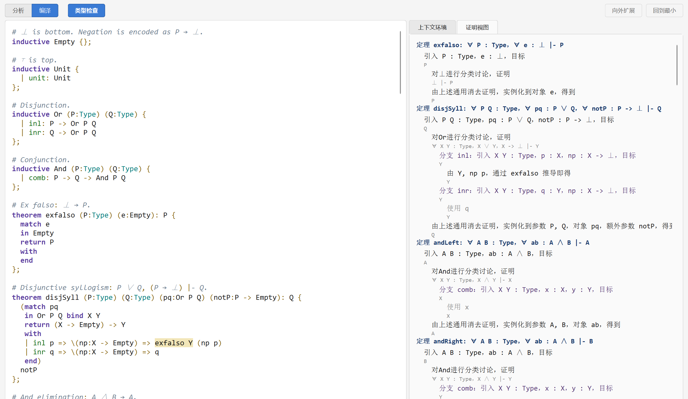
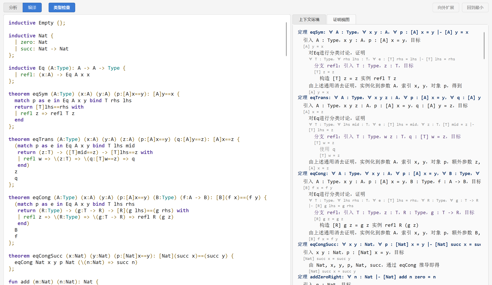
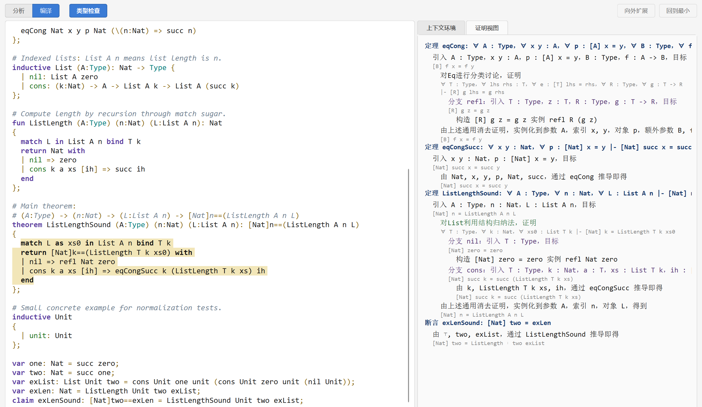
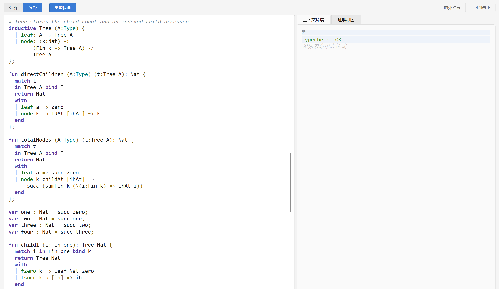

##  正测试

正测试覆盖命题逻辑、自然数、列表与树四种用例，验证类型检查器对合法证明的接受能力，以及证明可视化对柯里-霍华德同构的展示效果。

### 上下文测试

### 类型检查测试

####  命题逻辑

测试用例定义了 Empty（$\bot$）、Unit（$\top$）、Or（$\lor$）和 And（$\land$）四个归纳类型，在此基础上证明了爆炸原理（$\bot \to P$）、析取三段论（$P \lor Q, \neg P \vdash Q$）、合取消去、蕴含传递、双重否定引入、逆否命题、$\neg\neg(P \lor \neg P)$ 等经典直觉主义逻辑定理。

GUI 证明可视化将上述定理的证明项翻译为自然语言证明叙述：

#### 自然数

测试用例定义了 Nat 类型（zero、succ）与 Eq 类型（refl），证明了相等性的对称性、传递性与同余性，以及自然数加法的交换律与结合律。消去子 `Nat.rec` 的 Iota 规约在此得到充分验证。

#### 列表

测试用例定义了带长度索引的 List 类型（`List A n`），构造器 nil 对应长度为 zero 的空列表，cons 将列表长度加一。核心定理 ListLengthSound 证明了类型上的长度索引 $n$ 与递归计算得到的长度 `ListLength A n L` 命题相等——这意味着构造器返回类型中各索引表达式的计算结果与类型标注的索引值一致，验证了依赖归纳类型索引消去的正确性。

#### 树

测试用例定义了多叉树类型 Tree，其 node 构造器包含高阶递归字段 `Fin k -> Tree A`，验证了高阶归纳假设的生成与消去。

