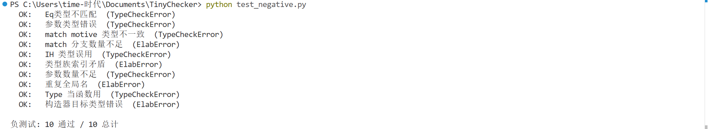

## 负测试

负测试验证类型检查器能正确拒绝逻辑不成立的证明，共设计 10 个错误用例。

**1. Eq 类型不匹配**

`refl` 的类型是 $\text{Eq}\ A\ x\ x$，两边必须相同。以下代码用 `refl Nat zero` 冒充 `[Nat] zero==(succ zero)` 的证明，转换检查发现 `zero` 与 `succ zero` 不可定义相等，报 TypeCheckError。

```
claim bad: [Nat] zero==(succ zero) = refl Nat zero;
```

**2. 参数类型错误**

`succ` 的类型为 $\text{Nat} \to \text{Nat}$，传入 `Bool` 类型的 `true` 导致 infer 推导出的实参类型与形参类型不匹配。

```
claim bad: Nat = succ true;
```

**3. match motive 类型不一致**

motive 声明返回 `Bool`，但 zero 分支给出 `zero : Nat`，succ 分支给出 `succ k : Nat`，check 时发现分支体类型与 motive 声明的返回类型不匹配。

```
match n in Nat return Bool with
| zero => zero
| succ k [ih] => succ k
end
```

**4. match 分支数量不足**

Nat 有两个构造器 `zero` 与 `succ`，但 match 只写了 zero 分支，繁饰阶段即报 ElabError。

```
match n in Nat return Nat with
| zero => zero
end
```

**5. IH 类型误用**

succ 分支的归纳假设 `ih` 类型为 `[Nat] (add k b)==(add b k)`，但分支直接将其作为结论返回——而结论类型是 `[Nat] (add (succ k) b)==(add b (succ k))`，两者不定义相等。

```
| succ k [ih] => ih
```

**6. 类型族索引矛盾**

scrutinee `L` 的实际类型为 `List A zero`，但 match 的 `in` 子句声称消去 `List A (succ zero)`，繁饰阶段发现 scrutinee 的类型族索引与 `in` 中声明的不一致，报 ElabError。

```
fun bad (A:Type) (L:List A zero): A {
  match L in List A (succ zero) bind T idx return A with
  | nil => ...
  | cons k a xs => a
  end
};
```

**7. 参数数量不足**

`idNat` 需要传入一个 Nat，但 `claim` 中无参引用，应用链展开后类型为 $\text{Nat} \to \text{Nat}$ 而非声明的 `Nat`。

```
fun idNat (n:Nat): Nat { n };
claim bad: Nat = idNat;
```

**8. 重复全局名**

同一名字被重复定义为归纳类型，繁饰阶段发现 `global_tags` 中已存在同名条目，报 ElabError。

**9. Type 当函数用**

`Nat : Type`，不是函数类型，不能作用于 `zero`。infer 发现 `Nat` 的 WHNF 为 `CType` 而非 `CPi`，报 TypeCheckError。

```
claim bad: Type = Nat zero;
```

**10. 构造器目标类型错误**

Bool 的构造器 `true` 声明返回类型为 `Nat`，但 Bool 的类型构造器是 `Bool`。繁饰阶段检查发现构造器的目标类型头部不是 `Bool`，报 ElabError。

```
inductive Bool { | true: Nat | false: Bool };
```

全部用例均被类型检查器或繁饰器正确拒绝（7 个 TypeCheckError，3 个 ElabError），验证了系统对非法证明的鉴别能力。


