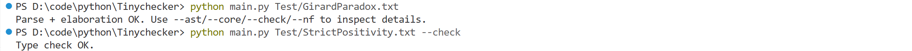
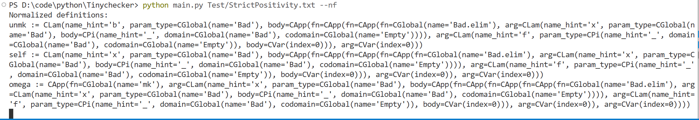
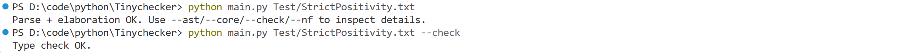
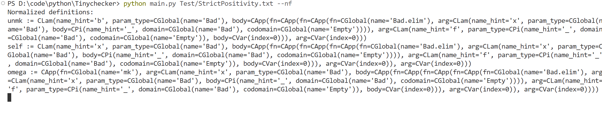

## 系统边界测试

本系统未实现类型宇宙分层与严格正性检查，因此不具备逻辑一致性。以下两个测试分别验证 Girard 悖论和负出现均可通过类型检查，但任何利用它们构造假命题的尝试必然导致范式计算不终止。

### Girard 悖论

Girard 通过构造一个自指类型 `Box` 及其操作函数 `Pack` 与 `Unpack`，在无类型宇宙的系统中实现了类型层面的自应用，从而导出任意类型 $X$ 的实例。具体地，从 $A$ 和 $A \to X$ 出发构造 $f\ a$，其求值行为为无穷膨胀循环：

$$f\ a \to (a\ R\ r)\ a \to r\ \text{self}\ r\ a \to (a\ R\ r)\ K_1 \to r\ \text{self}\ r\ K_1 \to K_1\ R\ r\ K_2 \to \ldots$$

其中 $K_n = \lambda p.\, \lambda hp.\, K_{n-1}\ p\ hp$，$K_1 = \lambda p.\, \lambda hp.\, a\ p\ hp$。该序列永不终止。在有类型宇宙的系统中，`self` 所需的类型层级将超出宇宙限制而被类型检查拒绝。

下图显示本系统对该悖论构造通过了类型检查，但在求范式时因无限循环而耗尽步数：





### 负出现

归纳类型定义中，若构造器的参数类型以非正位置出现被定义类型自身，则可能编码自 application 而导致不一致。以下 `Bad` 类型中，构造器 `mk` 的参数类型 `Bad -> Bool` 在箭头左侧出现了 `Bad`，属于负出现：

```
inductive Bad {
  mk : (Bad -> Bool) -> Bad
};
```

通过 `take_f` 将构造器内的函数取出，`self_apply` 将其作用于自身，可构造出 `Empty` 类型的值。该值的求值同样永不终止，项长度不会减小：

$$(\lambda x.\, \text{take\_f}\ x\ x)\ (\text{mk}\ (\lambda x.\, \text{take\_f}\ x\ x)) \to \text{take\_f}\ (\text{mk}\ \ldots)\ (\text{mk}\ \ldots) \to \ldots$$

下图显示 `Bad` 类型及其悖论构造通过了类型检查，但求范式同样因无限循环失败：





### 小结

Girard 悖论和负出现均可通过本系统的类型检查，对应的悖论项在求范式时必然不终止。因此，虽然系统不保证逻辑一致性，但在不引入额外公理的前提下，一个证明若能正常求得范式，则说明其未利用系统的不一致性——这为教学场景提供了足够的可靠性：合法的证明（如加法交换律）能顺利求范式，而试图利用悖论构造假命题必然失败。
